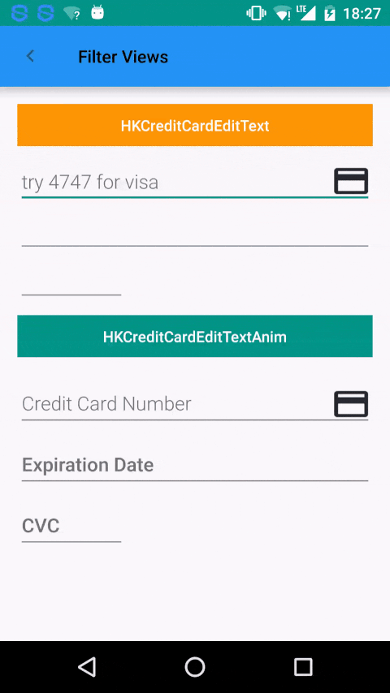

<h1 align="center"> Commons </h1>

[]() [](http://www.apache.org/licenses/LICENSE-2.0.html)

Commons(`commonslib`) is a library containing some often used custom views

<br/>
<h3>Usage:</h3>

Add `jitpack.io` in your root `build.gradle` :

```groovy
allprojects {
 repositories {
    maven { url "https://jitpack.io" }
 }
}
```
_Note:_ do not add the `jitpack.io` repository under `buildscript`

Add the `dependency` in your app `build.gradle` :
```groovy
dependencies {
    compile 'com.github.hrskrs:Commons:{releaseTag}'
}
```


<br/>
<h2>Custom Views</h2>


<br />
<h3> HKTextView </h3>
A `View` extended from `AppCompatTextView`. Hence it behaves exactly same as `AppCompatTextView` itself. The only difference is that it has <b>custom font</b> integrated which can be used as following:

By default, you should create a folder called as <b>fonts</b> in  <b>assets</b> folder, and include your custom fonts (the name of custom font will be used as a parameter):

If you want to use different name for fonts folder you can do it using  `setFontSrcDirectory(String)` setter:

`myHkTextView.setFontSrcDirectory("myFontsDir");`

or for subfolders:

`myHkTextView.setFontSrcDirectory("myFontsDir/mySubDir");`

<h5> `XML` usage: </h5>
```xml 
<com.hrskrs.commonslib.views.HKTextView
      ...
	app:hkCustomFont="Helvetica-Normal"
      ...
    android:layout_width="match_parent"
    android:layout_height="wrap_content"
    android:hint="Custom Font (Helvetica-Normal)"
    android:textColor="@color/c_009688"
 />
```
<h5> Setters/Getters: </h5>

```java
//Custom Font directory/subdirectory
setFontSrcDirectory(String);
String getFontSrcDirectory();

//Custom Font name 
setFontName(String);
String getFontName();
```

<br />
<h3> HKEditText </h3>
A `View` extended from `AppCompatEditText`. Hence it behaves exactly same as `AppCompatEditText`. The only difference is that you can set a custom font same as `HKEditText`.

<h5> `XML` usage: </h5>
```xml
 <com.hrskrs.commonslib.views.HKEditText
      android:layout_width="match_parent"
      android:layout_height="wrap_content"
      android:hint="Custom Font (Helvetica-Normal)"
      android:textColor="@color/c_009688"
      android:textColorHint="@color/c_009688"
      app:hkCustomFont="Helvetica-Normal"/>
```

<h5> Setters/Getters: </h5>
```java
//Custom Font directory/subdirectory
setFontSrcDirectory(String);
String getFontSrcDirectory();

//Custom Font name 
setFontName(String);
String getFontName();
```

<br />
<h3> HKEditTextAnim </h3>
A `View` extended from `TextInputLayout` implementing `HkEditText` as a child. Hence it behaves exactly same as `TextInputLayout` by accepting `HKEditText` parameters also. When you want to refer to `HKEditText` parameters dynamically, you must call `getHkEditText()` getter and set the parameters on it. Otherwise it will refer to the `TextInputLayout`:

<h5>`XML` usage:</h5>
```xml 
<com.hrskrs.commonslib.views.HKEditTextAnim
      android:layout_width="match_parent"
      android:layout_height="wrap_content"
      android:hint="Custom Font (Helvetica-Normal)"
      android:textColor="@color/c_009688"
      android:textColorHint="@color/c_009688"
      app:hkCustomFont="Helvetica-Normal" />
 />
```

<h5>Setters/Getters:</h5>
```java
//Refering to EditText inside TextInputLayout
HKEditText getHkEditText();
setHkEditText(HKEditText);
```

<br />
<h3> HKCreditCardEditText </h3>



A `View` extended from `HKEditText`. Hence it behaves exactly same as `HKEditText` allowing setting custom font. The difference is that it is designed to work for credit card inputs.
It shows an icon based on type card you type. Right now it supports `VISA`, `MASTERCARD` and `APEX`. As a default it show a colorless cc icon.
It has three input types which can be declared through `xml` as `hkType` and a divider which can be set through `hkDivider`: 
<ul>
<li>`CC_NO` if the input will be Credit Card Number </li>
<li>`CC_DATE` if the input will be Credit Card Date </li>
<li>`CC_NO` if the input will be Credit Card CVC Number </li>

<i>
The divider is set as a `char`. Hence if `hkDivider` contains a string with a length greater than 1 the first char will be used as a divider.
If `hkType` is set to `CC_CVC`, the `hkDivider` will be ignored.

<h5> `XML` usage: </h5>
```xml
  <!--Credit Card NO-->
  <com.hrskrs.commonslib.views.HKCreditCardEditText
    app:hkDivider=" "
    android:hint="try 4747 for visa"
    app:hkType="CC_NO"
    app:hkCustomFont="Roboto-Light"
    android:layout_width="match_parent"
    android:layout_height="wrap_content" />
    
  <!--Credit Card DATE-->
  <com.hrskrs.commonslib.views.HKCreditCardEditText
    app:hkDivider="^"
    app:hkType="CC_DATE"
    android:layout_width="match_parent"
    android:layout_height="wrap_content" />
    
  <!--Credit Card CVC-->
  <com.hrskrs.commonslib.views.HKCreditCardEditText
    app:hkType="CC_CVC"
    android:layout_width="100dp"
    android:layout_height="wrap_content" />
```

<h5> Setters/Getters: </h5>
```java
//Divider
setDivider(char);
char getDivider();

//Credit Card Type (0 => CC_NO, 1 => CC_DATE, 2 => CC_CVC)
setCcType(int);
String getCcType();
```

<br />
<h3> HKCreditCardEditTextAnim </h3>
A `View` extended from `TextInputLayout` implementing `HKCreditCardEditText` as a child. Hence it behaves exactly same as `TextInputLayout` by accepting `HKCreditCardEditText` parameters also. When you want to refer to `HKCreditCardEditText` parameters dynamically, you must call `getHkCreditCardEditText()` getter and set the parameters on it. Otherwise it will refer to the `TextInputLayout`:

<h5>`XML` usage:</h5>
```xml 
  <!--Credit Card Number-->
  <com.hrskrs.commonslib.views.HKCreditCardEditTextAnim
    android:layout_width="match_parent"
    android:layout_height="wrap_content"
    android:hint="Credit Card Number"
    app:hkCustomFont="Roboto-Light"
    app:hkDivider=" "
    app:hkType="CC_NO" />

  <!--Expiration Date-->
  <com.hrskrs.commonslib.views.HKCreditCardEditTextAnim
    android:layout_width="match_parent"
    android:layout_height="wrap_content"
    android:hint="Expiration Date"
    app:hkDivider="/"
    app:hkType="CC_DATE" />

  <!--CVC-->
  <com.hrskrs.commonslib.views.HKCreditCardEditTextAnim
    android:layout_width="100dp"
    android:layout_height="wrap_content"
    android:hint="CVC"
    app:hkType="CC_CVC" />
```

<h5>Setters/Getters:</h5>
```java
//Refering to EditText inside TextInputLayout
HKCreditCardEditText getHkCreditCardEditText();
setHkCreditCardEditText(HKCreditCardEditText );
```

<h4>References</h4>
-https://github.com/Gary111/MaskedEditText <br/>

# License

    Copyright (C) 2016 Haris Krasniqi

    Licensed under the Apache License, Version 2.0 (the "License");
    you may not use this file except in compliance with the License.
    You may obtain a copy of the License at

         http://www.apache.org/licenses/LICENSE-2.0

    Unless required by applicable law or agreed to in writing, software
    distributed under the License is distributed on an "AS IS" BASIS,
    WITHOUT WARRANTIES OR CONDITIONS OF ANY KIND, either express or implied.
    See the License for the specific language governing permissions and
    limitations under the License.